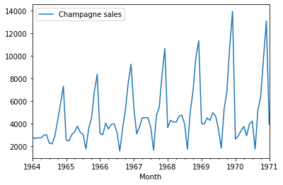

# Modelo Arima

Una ARIMA, o media móvil integrada autorregresiva, es una generalización de una media móvil autorregresiva (ARMA) y se ajusta a los datos de series temporales en un esfuerzo por pronosticar puntos futuros. Los modelos ARIMA pueden ser especialmente eficaces en los casos en que los datos muestran evidencia de no estacionariedad.

## Instalación

Ejecutar el siguiente comando en la consola para instalar la libreria `Pmdarima`

```python
pip install pmdarima
```

## Carga de los datos

Una vez instalada, se debe importar `Pandas` y cargar los datos con los que se entrenara el modelo. Para este ejemplo, el conjunto de datos que estaremos utilizando almacena el histórico de ventas de champaña que se registradas entre los años 1964 y 1972.

```python title="Carga de los datos"
import pandas as pd
ventas = pd.read_csv('Champagne Sales.csv')
ventas.head(4)
```

Salida:

<table>
    <tr>
        <th></th>
        <th>Month</th>
        <th>Champagne sales</th>
    </tr>
    <tr>
        <td>0</td>
        <td>1964-01</td>
        <td>2815</td>
    </tr>
    <tr>
        <td>1</td>
        <td>1964-02</td>
        <td>2672</td>
    </tr>
    <tr>
        <td>2</td>
        <td>1964-03</td>
        <td>2755</td>
    </tr>
    <tr>
        <td>3</td>
        <td>1964-04</td>
        <td>2946</td>
    </tr>
</table>

## Transformación

Al momento de trabajar con series temporales, debemos asegurarnos de que el conjunto de datos posea al menos una columna tiempo y a su vez, esta sea de tipo `date` o `time`. Para ello, a continuación, verificamos el tipo de dato de la columna temporal.

```python
ventas.dtypes
```

```bash title="Salida"
Month              object
Champagne sales     int64
dtype: object
```

Observe que `Month` es de tipo `Object`. Esto generara problemas al momento de entrenar nuestro modelo, por lo tanto, se debe realizar la conversión a tipo `date`.

```python
ventas['Month'] = pd.to_datetime(ventas['Month'])
```

También, es importante establecer la variable tiempo como el índice de nuestros datos debido a que el `eje x` de la serie temporal siempre debe ser la variable tiempo.

```python
ventas.set_index('Month',inplace=True)
ventas.head(4)
```

Salida:

<table>
    <tr>
        <th>Month</th>
        <th>Champagne sales</th>
    </tr>
    <tr>
        <td><strong>1964-01</strong></td>
        <td>2815</td>
    </tr>
    <tr>
        <td><strong>1964-02</strong></td>
        <td>2672</td>
    </tr>
    <tr>
        <td><strong>1964-03</strong></td>
        <td>2755</td>
    </tr>
    <tr>
        <td><strong>1964-04</strong></td>
        <td>2946</td>
    </tr>
</table>

## Graficación de los datos

```python
import matplotlib.pyplot as plt
ventas.plot()
```


En el siguiente paso se procede a dividir el conjunto de datos de tal manera que alrededor del 80% de los datos sea destinado a entrenar y el 20% restante sea para probar el modelo.

```python
train = ventas[:85] # 85 datos para entrenamiento
test = ventas[-20:] # 20 datos para pruebas

train.plot()
```

:::info
Nota que la gráfica ahora está excluyendo el año 1972 que corresponde al último año registrado en el conjunto de datos.
:::

### Conjunto de datos para el Entrenamiento



### Conjunto de datos para las Pruebas


```python
plt.plot(train)
plt.plot(test)
```


La sección color naranja es excluida del dataset de entrenamiento para verificar la veracidad de la predicción que arroje el modelo más adelante en este tutorial.

## Entrenamiento del modelo ARIMA

El primer paso para entrenar nuestro modelo de predicciones es importar la librería `pmdarima`.

```py
from pmdarima.arima import auto_arima
```

La librería pmdarima trae consigo la función que te permitirá configurar los parámetros que necesitará el método `auto_arima` para entrenar el modelo. Conoce todos los detalles sobre de cada uno de los parámetros visitando la [documentación oficial de Pmdarima](https://alkaline-ml.com/pmdarima/modules/generated/pmdarima.arima.ARIMA.html).


Al ejecutar el siguiente código realizara una búsqueda por pasos para minimizar el aic.

:::info
### AIC (Akaike information criteria)
El criterio de información de Akaike es una medida de la calidad relativa de un modelo estadístico, para un conjunto dado de datos. Este valor de calidad le permite a auto_arima encontrar el modelo que mejor se ajusta a nuestro conjunto de datos.
:::

```py
modelo = auto_arima(train, start_p=0, start_q=0, max_p=10, max_d=10,
                    max_q=10, start_P=0, start_Q=0, max_P=10,
                    max_D=10, max_Q=10, m=12, seasonal=True, 
                    information_criterion='aic', alpha=0.05, 
                    test='kpss', seasonal_test='ocsb', stepwise=True, 
                    n_jobs=1, method='lbfgs', maxiter=50, 
                    offset_test_args=None, seasonal_test_args=None, 
                    suppress_warnings=True, error_action='trace', trace=True,n_fits=50)
```

El método comenzara a ajustar los datos automáticamente para entregar el mejor resultado.

```bash title="Output"
Performing stepwise search to minimize aic
 ARIMA(0,1,0)(0,1,0)[12]             : AIC=1203.853, Time=0.06 sec
 ARIMA(1,1,0)(1,1,0)[12]             : AIC=1192.025, Time=0.17 sec
 ARIMA(0,1,1)(0,1,1)[12]             : AIC=1176.246, Time=0.39 sec
 ARIMA(0,1,1)(0,1,0)[12]             : AIC=1174.731, Time=0.13 sec
 ARIMA(0,1,1)(1,1,0)[12]             : AIC=1176.034, Time=0.30 sec
 ARIMA(0,1,1)(1,1,1)[12]             : AIC=1176.700, Time=0.68 sec
 ARIMA(1,1,1)(0,1,0)[12]             : AIC=1175.054, Time=0.20 sec
 ARIMA(0,1,2)(0,1,0)[12]             : AIC=1174.769, Time=0.33 sec
 ARIMA(1,1,0)(0,1,0)[12]             : AIC=1194.721, Time=0.12 sec
 ARIMA(1,1,2)(0,1,0)[12]             : AIC=1174.564, Time=1.23 sec
 ARIMA(1,1,2)(1,1,0)[12]             : AIC=inf, Time=1.99 sec
 ARIMA(1,1,2)(0,1,1)[12]             : AIC=inf, Time=2.17 sec
 ARIMA(1,1,2)(1,1,1)[12]             : AIC=1176.641, Time=3.90 sec
 ARIMA(2,1,2)(0,1,0)[12]             : AIC=1176.127, Time=1.58 sec
 ARIMA(1,1,3)(0,1,0)[12]             : AIC=1176.124, Time=1.89 sec
 ARIMA(0,1,3)(0,1,0)[12]             : AIC=1176.458, Time=0.74 sec
 ARIMA(2,1,1)(0,1,0)[12]             : AIC=1176.656, Time=0.62 sec
 ARIMA(2,1,3)(0,1,0)[12]             : AIC=1180.596, Time=2.49 sec
 ARIMA(1,1,2)(0,1,0)[12] intercept   : AIC=inf, Time=1.26 sec

Best model:  ARIMA(1,1,2)(0,1,0)[12]          
Total fit time: 20.395 seconds
```

:::tip
Correctamente `auto_rima` encuentra el mejor modelo para predecir de acuerdo con nuestro conjunto de datos. 
```
Best model:  ARIMA(1,1,2)(0,1,0)[12]          
Total fit time: 20.395 seconds
```
`ARIMA(1,1,2)(0,1,0)[12]` es el mejor modelo debido a que su `AIC=1174.564` es el menor de todos los resultados. 
:::

Una vez con el modelo, podremos predecir con el conjunto de datos que separamos para la prueba llamado `train`.

```py
# highlight-next-line
p = pd.DataFrame(modelo.predict(n_periods=20),index=test.index)
p.columns=['prediccion']
p.head(4)
```

<table>
    <tr>
        <th>Month</th>
        <th>Predicción del modelo</th>
    </tr>
    <tr>
        <td><strong>1971-02-01</strong></td>
        <td>2746.705536</td>
    </tr>
    <tr>
        <td><strong>1971-03-01</strong></td>
        <td>3247.915385</td>
    </tr>
    <tr>
        <td><strong>1971-04-01</strong></td>
        <td>3592.504230</td>
    </tr>
    <tr>
        <td><strong>1971-05-01</strong></td>
        <td>2800.878941</td>
    </tr>
</table>

A continuación, volvemos a graficar el conjunto de datos para comparar los resultados predichos por el modelo con los datos históricos.

```py
plt.figure()
plt.plot(train,label='Entrenamiento')
plt.plot(test,label='Prueba')
plt.plot(p,label='Prediccion')
plt.legend(loc='left corner')
plt.show()
```


La grafica provee información valiosa que nos permite determinar si el modelo funciona correctamente. Hay que tener en cuenta que los datos de prueba no hicieron del entrenamiento, por lo que son desconocidos por parte del entrenamiento. De este modo, se observa que los resultados de la predicción se asemejan al comportamiento de los datos de prueba, pues reflejan un aumento en las ventas de Champaña del mes de diciembre del año predicho. 

:::caution

Ten en cuenta que en las series temporales, entre menor sea el número de periodos, más efectiva será la predicción. Observe el resultado de la predicción cuando se hace uso de un número de periodos muy alto en el método `predict()` del modelo arima.

```py
pd.DataFrame(modelo.predict(n_periods=280)).plot()
```


:::


